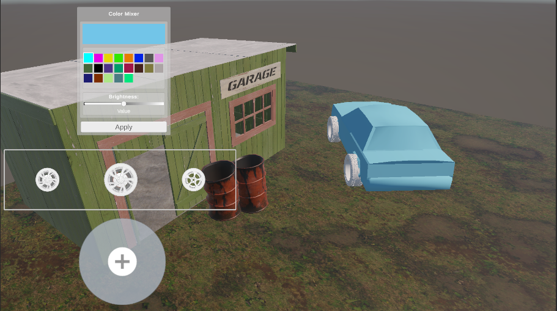

# Unity Widget Development Project
3D CAR CONFIGURATOR - Student Project

This project was developed as part of the Human-Computer Interface (HCI) course for 1st year Computer Science students at the Faculty of Sciences, University of Poitiers.

## Table of Contents

- [Unity Widget Development Project](#unity-widget-development-project)
  - [Table of Contents](#table-of-contents)
  - [Project Information](#project-information)
  - [Project Overview](#project-overview)
  - [Screenshots](#screenshots)
  - [Features](#features)
    - [Widget 1: ColorMixer](#widget-1-colormixer)
    - [Widget 2: Carousel 2D](#widget-2-carousel-2d)
    - [Widget 3: Rotation Joystick](#widget-3-rotation-joystick)
    - [Core Mechanics](#core-mechanics)
  - [Technologies Used](#technologies-used)
  - [How to Use](#how-to-use)
  - [Project Structure](#project-structure)
  - [Widget Documentation](#widget-documentation)
    - [ColorMixer Integration](#colormixer-integration)
    - [Carousel 2D Integration](#carousel-2d-integration)
    - [Rotation Joystick Integration](#rotation-joystick-integration)
  - [Technical Challenges and Solutions](#technical-challenges-and-solutions)
  - [Team Distribution](#team-distribution)
  - [Future Improvements](#future-improvements)
  - [Conclusion](#conclusion)

## Project Information

- **Course**: Human-Computer Interface (HCI)
- **University**: University of Poitiers, Faculty of Sciences
- **Students**: Ronan PLUTA | Lillo G.
- **Instructors**: Hakim Ferrier-Belhaouari | Xavier Skapin
- **Academic Year**: 2025
- **Development Platform**: Unity 3D
- **Programming Language**: C#

## Project Overview

This Unity project focuses on creating interactive widgets for human-computer interfaces. The objective was to leverage knowledge gained from previous practical work to design and implement reusable interface components.

**Main Application**: A 3D car configurator where users can:
- **Customize car body colors** using the ColorMixer widget
- **Change vehicle wheels** through the Carousel 2D widget  
- **Rotate the vehicle** for 360° viewing with the Rotation Joystick

All widgets were created without using Unity's Asset Store, exclusively using techniques learned in class. Each widget meets project requirements: dynamic aspects, environmental influence, and Prefab conversion for reusability.

## Screenshots

**Car Configurator Interface**


## Features

### Widget 1: ColorMixer

**Advanced color mixing system for vehicle customization:**
- **Multi-color selection** from predefined palette
- **Brightness adjustment** via interactive slider
- **Real-time color preview** with live mixing visualization
- **Instant application** to car body materials
- **Visual feedback** for selected/deselected color buttons
- **Additive color mixing algorithm** with square root weighting
- **Brightness control**: blend with black (<50%) or white (>50%)

### Widget 2: Carousel 2D

**Intuitive navigation system for wheel selection:**
- **Three-image display**: previous, selected, and next wheel
- **Left/right navigation** with clearly visible arrow buttons
- **Circular navigation** (infinite loop through options)
- **Visual hierarchy** with enlarged center image
- **Seamless integration** with 3D car model
- **Configurable sprite system** (minimum 3 required)

### Widget 3: Rotation Joystick

**Precise 3D object rotation control:**
- **Multi-axis rotation** control (X, Y, Z axes)
- **Adjustable rotation speed** for fine-tuned control
- **Optional axis inversion** for better ergonomics
- **Local or world space rotation** modes
- **Visual joystick interface** with constrained movement
- **Automatic centering** when released
- **Real-time rotation feedback**

### Core Mechanics

- **Modular widget architecture** for easy reusability
- **Prefab-based system** for drag-and-drop integration
- **Real-time 3D car visualization** with interactive materials
- **Responsive UI design** optimized for 1920x1080 resolution
- **Event-driven interaction system** with Unity's UI framework
- **Material instancing** for dynamic color changes
- **Transform manipulation** for object rotation

## Technologies Used

- **Game Engine**: Unity 3D (latest version)
- **Programming Language**: C# (.NET Framework)
- **3D Modeling**: Blender (custom car model creation)
- **UI Framework**: Unity UI System (Canvas, Event System)
- **Version Control**: Git
- **Development Environment**: Unity Editor
- **Target Platform**: Windows Desktop

## How to Use

The car configurator operates through three main widget interfaces:

1. **Color Customization**:
   - Select multiple colors from the ColorMixer palette
   - Adjust brightness using the horizontal slider
   - Preview the mixed result in the preview window
   - Click "Apply" to change the car's body color

2. **Wheel Selection**:
   - Use left/right arrows in the Carousel 2D
   - View three wheel options simultaneously
   - Selected wheel (center) automatically applies to the car

3. **Vehicle Rotation**:
   - Drag the joystick handle to rotate the car
   - Control rotation on multiple axes
   - Release to auto-center the joystick

## Project Structure

```
3D_car_configurator/
├── Assets/
│   ├── Prefabs/           # Reusable widget prefabs
│   │   ├── ColorMixer/    # Color mixing widget
│   │   ├── Carousel2D/    # Wheel selection carousel
│   │   └── Joystick/      # Rotation control joystick
│   ├── Scripts/           # C# scripts organized by widget
│   │   ├── ColorMixer/    # ColorMixerWidget.cs, ColorButtonInfo.cs
│   │   ├── Carousel2D/    # Carousel2DManager.cs
│   │   └── Joystick/      # RotationJoystickScript.cs, RotationStickScript.cs
│   ├── Scenes/            # Main demo scene
│   ├── Models/            # 3D car and wheel models
│   ├── Materials/         # Car paint and wheel materials
│   └── Textures/          # UI sprites and textures
├── Packages/              # Unity package dependencies
├── ProjectSettings/       # Unity project configuration
└── README.md             # This documentation
```

## Widget Documentation

### ColorMixer Integration

**Setup**:
1. Add `ColorMixerWidget` prefab to your Canvas
2. Configure available colors in the inspector
3. Assign target renderers (car body parts)
4. Customize button layout and appearance

**API Usage**:
```csharp
// Get widget reference
ColorMixerWidget mixer = GetComponent<ColorMixerWidget>();

// Add target object
mixer.SetTargetRenderer(carBody.GetComponent<Renderer>());

// Add new color option
mixer.AddColor(Color.red);

// Change button layout
mixer.SetButtonsPerRow(5);
```

### Carousel 2D Integration

**Setup**:
1. Add `Carousel2D` prefab to your Canvas
2. Populate sprite list (minimum 3 sprites)
3. Configure left/right navigation buttons
4. Use API to respond to selection changes

**API Usage**:
```csharp
// Get widget reference
Carousel2DManager carousel = GetComponent<Carousel2DManager>();

// Get current selection
Sprite selectedWheel = carousel.GetSelectedCarousel();

// Navigate programmatically
carousel.Next();     // Move to next wheel
carousel.Previous(); // Move to previous wheel
```

### Rotation Joystick Integration

**Setup**:
1. Add `RotationJoystick` prefab to your Canvas
2. Assign target Transform (car model)
3. Configure rotation speed and axis preferences
4. Set local or world space rotation

**API Usage**:
```csharp
// Get widget reference
RotationJoystickScript joystick = GetComponent<RotationJoystickScript>();

// Set rotation target
joystick.SetTargetTransform(carModel.transform);

// Adjust rotation speed
joystick.SetRotationSpeed(150f);

// Toggle axis inversion
joystick.ToggleAxisInversion("x");
```

## Technical Challenges and Solutions

**ColorMixer Challenges**:
- **Dynamic UI generation**: Solved using coroutines for synchronized button creation
- **Material instancing**: Created material instances for runtime color changes
- **Natural color mixing**: Implemented square root weighting for intuitive results

**Carousel 2D Challenges**:
- **Circular navigation**: Resolved with modular indexing system
- **User experience**: Enhanced with visual hierarchy emphasizing selected item
- **3D Carousel attempt**: Explored but abandoned due to spatial positioning complexity

**Rotation Joystick Challenges**:
- **Handle constraint**: Mathematical distance calculation and circle projection
- **Visual feedback**: Synchronized handle position with rotation values
- **Touch event handling**: Implemented IDragHandler, IEndDragHandler, IPointerDownHandler

## Team Distribution

| Component/Task | Ronan PLUTA | Lillo G. |
|----------------|-------------|--------------|
| **ColorMixer** | Base structure, UI, documentation | Review and validation |
| **Git Setup** | Complete implementation | - |
| **Carousel 2D** | - | Concept and implementation, documentation |
| **Rotation Joystick** | Enhanced version, documentation | Initial version, documentation |
| **Car Configurator** | Widget integration, interface design, scene setup | - |
| **Documentation** | Report writing | Review and feedback |
| **3D Modeling** | - | Car model creation in Blender |

## Future Improvements

**ColorMixer Enhancements**:
- More realistic automotive paint models (metallic, pearlescent, matte finishes)
- Additional car body parts (bumpers, mirrors, trim)
- Color history and favorites system

**Carousel 2D Extensions**:
- Smooth transition animations between selections
- Vertical navigation support
- Grid layout option for simultaneous display
- Zoom functionality for selected items

**Rotation Joystick Improvements**:
- Return-to-center animation
- Axis locking for precise rotations
- Haptic feedback support
- Gesture recognition for advanced controls

**General Enhancements**:
- Mobile platform optimization
- VR/AR compatibility
- Advanced lighting system
- Car interior customization
- Multi-language support

## Conclusion

This Unity HCI project successfully demonstrates the creation of reusable, interactive widgets for 3D applications. The car configurator serves as an effective showcase for the three custom widgets: ColorMixer, Carousel 2D, and Rotation Joystick.

**Key Achievements**:
✅ **Modular architecture** enabling easy widget reuse  
✅ **Intuitive user interfaces** with clear visual feedback  
✅ **Robust technical implementation** following Unity best practices  
✅ **Comprehensive documentation** for future development  
✅ **Successful team collaboration** with clear task distribution  

The knowledge gained from this project provides a solid foundation for future developments in 3D interfaces, product configurators, video games, and virtual/augmented reality applications.

---

*University of Poitiers - Faculty of Sciences - Computer Science Department - 2025*